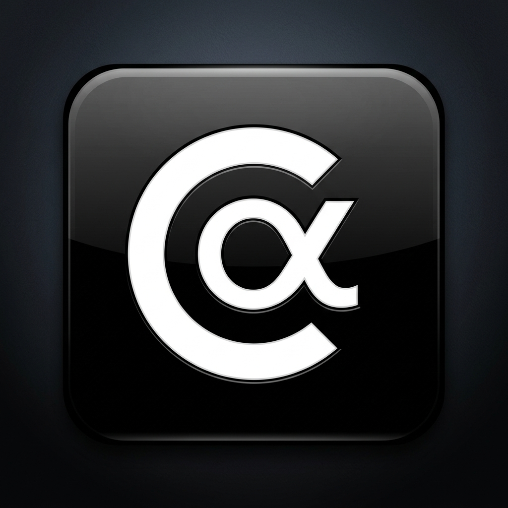

# 🔐 ClipAlpha
> **A zero-knowledge encrypted clipboard and file-sharing platform.**



ClipAlpha is a highly secure, ephemeral secret-sharing platform hosted 100% on AWS serverless infrastructure. 

The core principle: **The server physically cannot read what users share.** 
All encryption and decryption happens locally in the browser using the Web Crypto API. The server only stores and serves encrypted noise.

## 🌟 Key Features

*   **Zero-Knowledge Encryption:** Browser-side `PBKDF2` key derivation and `AES-256-GCM` encryption. The server never sees the plaintext or the encryption key.
*   **Ephemeral Storage:** Clips auto-destruct based on time (DynamoDB TTL), view limits, or a "Burn after reading" flag.
*   **Text & File Support:** Securely share text snippets, code, and files up to 50MB (and up to 1GB using S3 presigned URLs).
*   **Serverless Architecture:** Built on AWS Lambda, API Gateway, DynamoDB, S3, and CloudFront. Zero idle costs and infinite scalability.
*   **Admin Dashboard:** A separate admin dashboard for viewing high-level system usage and analytics without compromising user data.

## 🏗️ Architecture

ClipAlpha uses a modern, cost-effective serverless stack on AWS:

*   **Frontend:** React 18, Vite, Tailwind CSS, shadcn/ui. Hosted statically on S3 and distributed via CloudFront.
*   **API Layer:** Amazon API Gateway providing an HTTP API.
*   **Compute:** 7 specialized AWS Lambda functions (Node.js 20) handling creation, viewing, unlocking, slug checking, S3 downloads, and scheduled cleanup.
*   **Database:** DynamoDB (`pastit-clips`) for storing metadata (expiry, view counts, SHA-256 hashes for door-checks). Uses native TTL for auto-expiry.
*   **Storage:** S3 (`pastit-site-content`) for storing the actual `AES-256-GCM` encrypted blobs.
*   **Security:** AWS WAF in front of CloudFront handles rate-limiting and blocks known bad actors.

*(For a deep dive into the architecture, data flows, and security model, see the `pastit_architecture.md` file or our technical wiki).*

## 🔐 The Zero-Knowledge Guarantee

When a user creates a password-protected clip:

1.  **Browser:** Derives a 256-bit key from the password using `PBKDF2` (310,000 iterations, SHA-256, random salt).
2.  **Browser:** Encrypts the content using `AES-256-GCM` (random IV).
3.  **Browser:** Hashes the password using `SHA-256` for a server-side "door check" (this is *not* the encryption key).
4.  **Network:** Sends the *ciphertext, salt, IV, and password hash* to the server.
5.  **Server:** Stores the data. It cannot decrypt the ciphertext or reverse the password hash.

Decryption happens in reverse, entirely in the recipient's browser.

## 🚀 Getting Started

To run the frontend locally:

1.  Clone the repository:
    ```bash
    git clone https://github.com/your-username/secret-share-main.git
    cd secret-share-main
    ```
2.  Navigate to the main frontend directory:
    ```bash
    cd secret-share-main
    ```
3.  Install dependencies:
    ```bash
    npm install
    ```
4.  Create a `.env` file based on `.env.example` (or set `VITE_API_URL` to your API Gateway endpoint).
5.  Start the development server:
    ```bash
    npm run dev
    ```

## 🛠️ Deployment

Deploying the backend requires setting up the AWS infrastructure (Route 53, ACM, S3, DynamoDB, Lambda, API Gateway, CloudFront).
Detailed step-by-step instructions with AWS CLI commands and console walkthroughs are provided in `build_guide_extracted.txt`.

## 📁 Repository Structure

*   `/secret-share-main/`: The main React frontend (`clipalpha.com`).
*   `/dashboard-frontend/`: The admin dashboard SPA.
*   `/create_lambda/`, `/view_lambda/`, `/unlock_lambda/`, etc.: Source code for the backend AWS Lambda functions.
*   `/analytics_backend/`: Source code for the dashboard metrics Lambda.

## 🤝 Contributing

Contributions are welcome! Please open an issue or submit a pull request.

## 📄 License

[MIT License](LICENSE)
