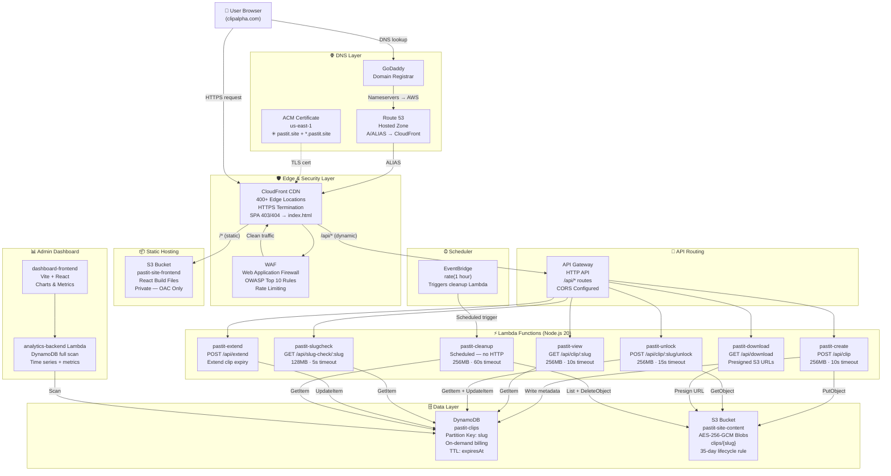
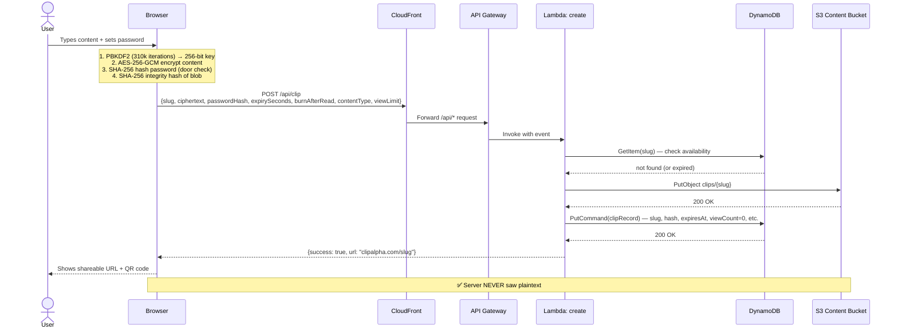
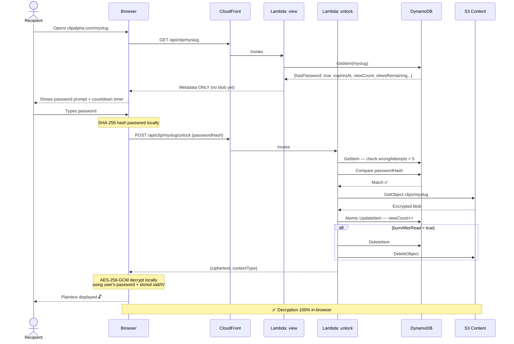
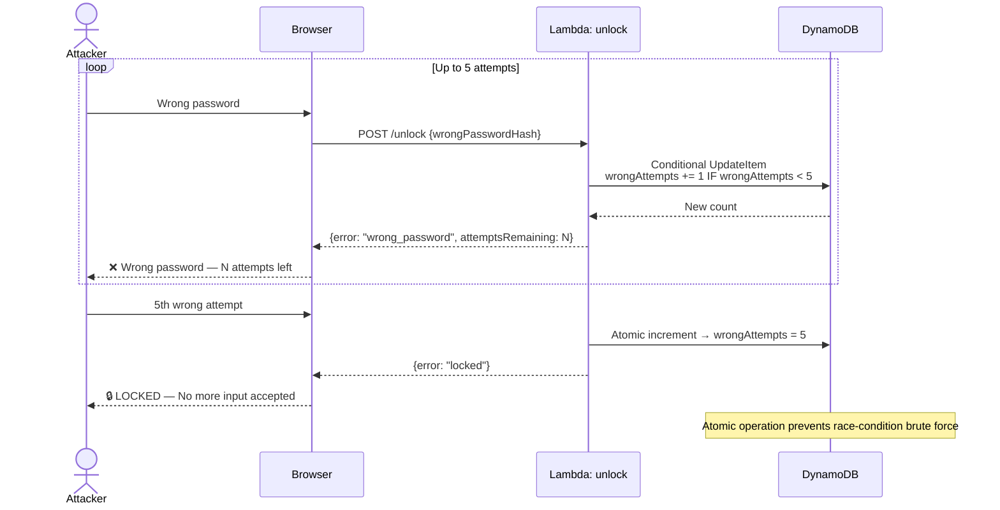
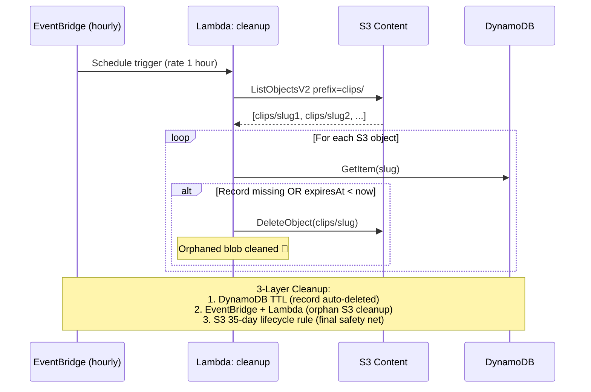
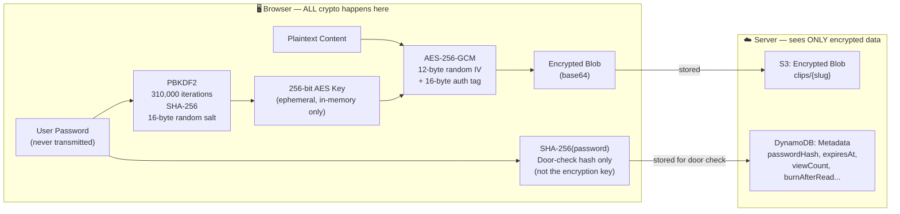
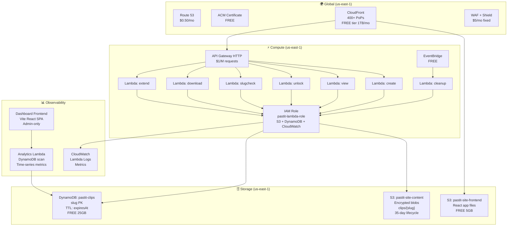
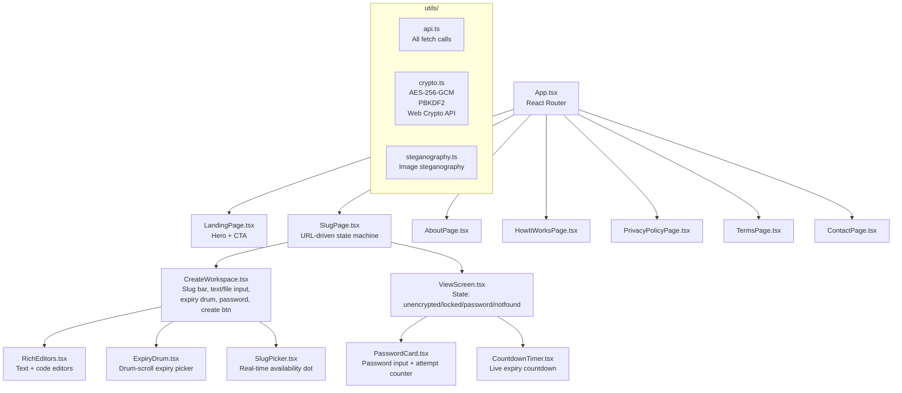
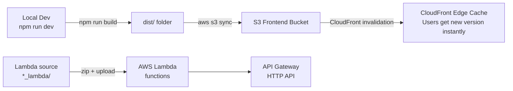

# 🔐 Pastit / ClipAlpha — Full System Architecture

> **Zero-knowledge encrypted clipboard. The server sees only encrypted noise.**

---

## 🗺️ The Big Picture

---

## 🔄 Request Flows

### Flow A — Creating a Clip

---

### Flow B — Viewing a Clip (Password Protected)

---

### Flow C — Wrong Password & Lockout

---

### Flow D — Scheduled Cleanup

---

## 🔐 Encryption Model (Zero-Knowledge)

| What the server stores | What the server can read |
|---|---|
| AES-256-GCM ciphertext | ❌ Nothing — encrypted noise |
| SHA-256(password) | ❌ Cannot reverse to password |
| PBKDF2 salt + IV | ❌ Useless without the password |
| Expiry, view count, flags | ✅ Metadata only |

---

## 🏗️ AWS Infrastructure Map

---

## 📡 API Endpoint Reference

| Method | Route | Lambda | Purpose |
|---|---|---|---|
| `POST` | `/api/clip` | `pastit-create` | Create new encrypted clip |
| `GET` | `/api/clip/:slug` | `pastit-view` | Fetch clip metadata (no blob) |
| `POST` | `/api/clip/:slug/unlock` | `pastit-unlock` | Verify password, return blob |
| `DELETE` | `/api/clip/:slug` | `pastit-unlock` | Delete clip immediately |
| `GET` | `/api/slug-check/:slug` | `pastit-slugcheck` | Real-time slug availability |
| `GET` | `/api/download` | `pastit-download` | Presigned S3 GET URL |
| `POST` | `/api/extend` | `pastit-extend` | Extend clip expiry (max 50 days) |
| `GET` | `/api/presign` | *(presign fn)* | Presigned S3 PUT URL for uploads |

---

## 🗃️ DynamoDB Schema

| Field | Type | Description |
|---|---|---|
| `slug` | String (PK) | URL slug — unique identifier |
| `passwordHash` | String / null | SHA-256 of password (door check) |
| `hasPassword` | Boolean | Quick flag |
| `expiresAt` | Number | **TTL field** — Unix timestamp |
| `expiresAtISO` | String | ISO string for frontend countdown |
| `viewCount` | Number | Successful views so far |
| `viewLimit` | Number / null | Max views cap |
| `viewsRemaining` | Number / null | Countdown |
| `wrongAttempts` | Number | Failed password attempts |
| `burnAfterRead` | Boolean | Delete after first view |
| `s3Key` | String | `clips/{slug}` |
| `contentType` | String | `text` / `file` / `multipart` |
| `createdAt` | String | ISO timestamp |

---

## 📊 Analytics Dashboard

The `dashboard-frontend` is a **separate admin Vite/React SPA** that calls the `analytics-backend` Lambda, which does a **full DynamoDB scan** and returns:

- `allTime` counters: clips created, viewed, destroyed, locked, by content type, by TTL bucket
- `last30Days`: daily time-series (created, viewed, wrongAttempts)
- `last24Hours`: hourly time-series

> Note: Deleted clips (burned/TTL'd) are invisible to scans — destruction stats are **estimated** (`~45%` destruction rate). A production-grade solution would use DynamoDB Streams or S3 event notifications.

---

## 💰 Monthly Cost (Early Stage)

| Service | Cost |
|---|---|
| Route 53 | $0.50 |
| ACM | FREE |
| CloudFront | FREE (< 1TB/mo) |
| S3 (both buckets) | FREE (< 5GB) |
| API Gateway | FREE (< 1M req) |
| Lambda (all functions) | FREE (< 1M invocations) |
| DynamoDB | FREE (< 25GB) |
| EventBridge | FREE |
| WAF | **$5.00/mo** |
| **TOTAL** | **~$5.50/mo** |

---

## 🗂️ Frontend Component Map

---

## 🚀 Deployment Flow

